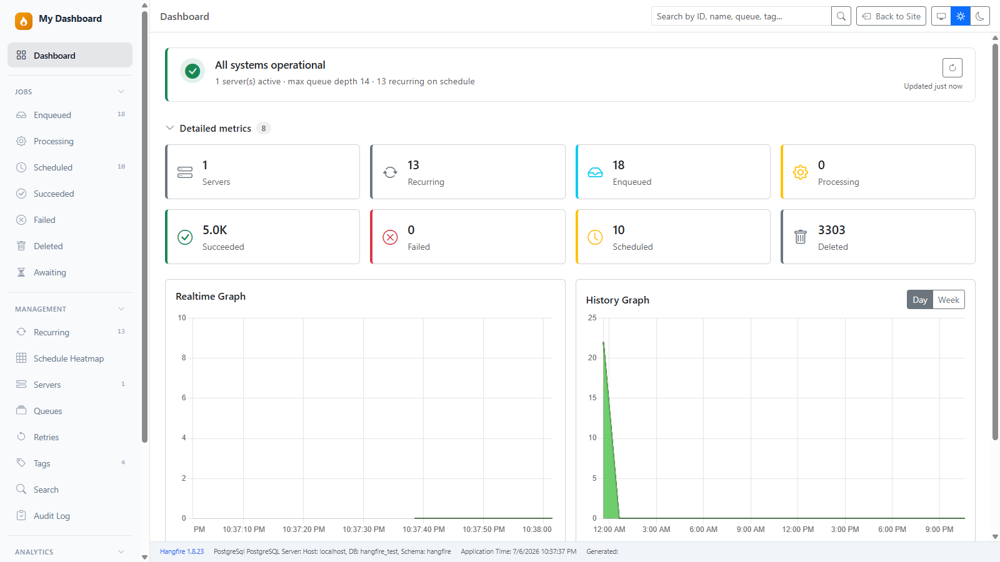
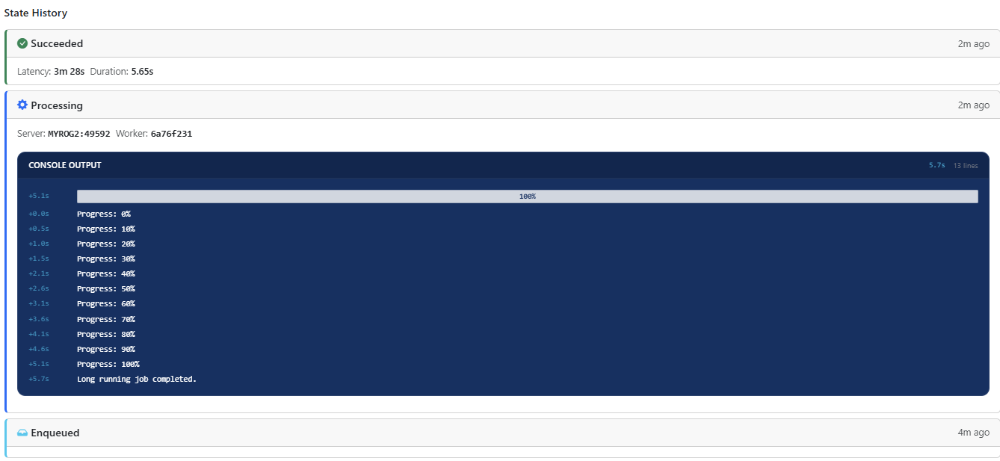
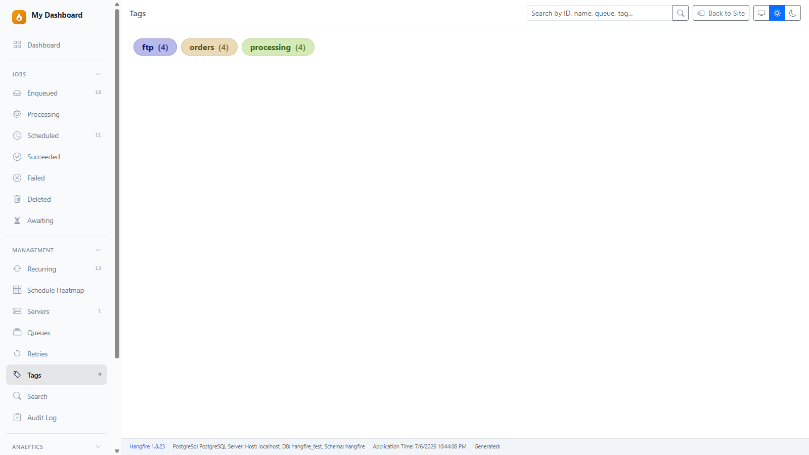
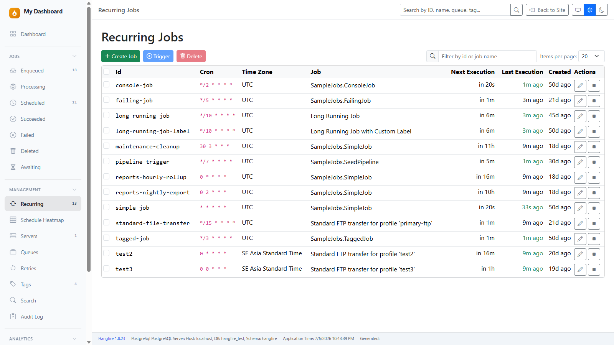
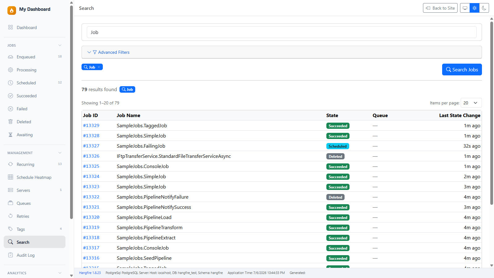
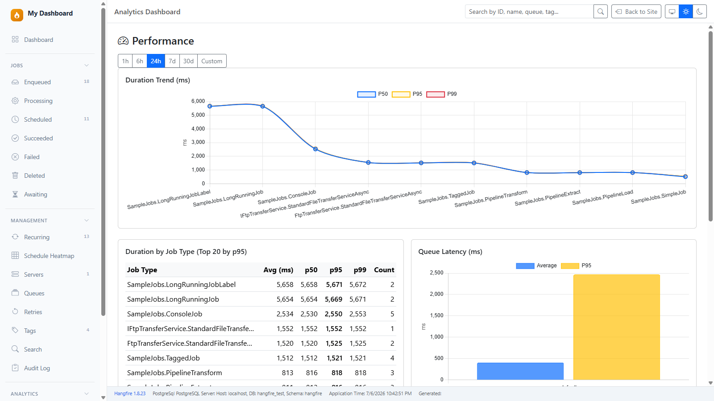
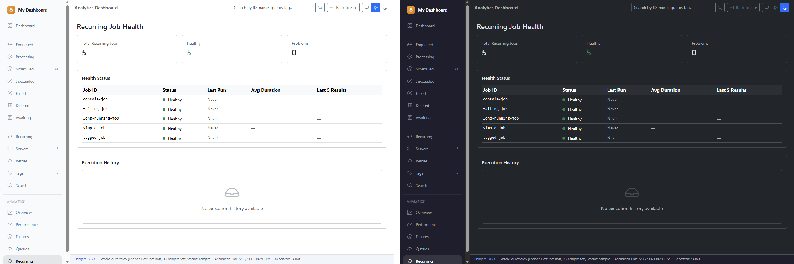

# a2n.Hangfire.Dashboard

**A modern, free alternative to the Hangfire Dashboard — with analytics, console logs, tags, and recurring job management built in.**

One NuGet package. Zero Pro license.

[](https://dotnet.microsoft.com/)
[](LICENSE)
[](https://www.hangfire.io/)

---


## Get Started in 30 Seconds

```bash
dotnet add package a2n.Hangfire.Dashboard
```

```csharp
// Replace app.UseHangfireDashboard() with:
builder.Services.AddHangfireDashboardUI();
app.UseHangfireDashboardUI("/hangfire");
```

Navigate to `/hangfire`. Done.

---

## The Problem

If you've used Hangfire in production, you've probably hit these walls:

- **Console logs?** Install `Hangfire.Console`. **Tags?** Install `Hangfire.Tags`. **Recurring job editor?** Install `Hangfire.RecurringJobAdmin`. Three extra packages, three sets of compatibility issues.
- **Want analytics?** That's Hangfire Pro. Per-developer licensing, starting at $500/year.
- **Search across jobs?** Not built in. You're writing SQL queries against the storage directly.
- **Dark mode?** The built-in dashboard is jQuery + Bootstrap 3. It follows system theme — no toggle, no choice.
- **Mobile?** Good luck reading that sidebar on a phone.

This project solves all of that in a single, free, open-source package.

---

## What You Get

| Feature | Built-in Dashboard | **This Dashboard** |
|---------|:-----------------:|:--------------:|
| Job state pages + batch operations | ✅ | ✅ |
| Recurring job CRUD (create, edit, start/stop) | View only | ✅ |
| Console output (logs, progress bars, colors) | ❌ (plugin) | ✅ |
| Job progress circle on Processing page | ❌ (plugin) | ✅ |
| Job tagging & tag cloud | ❌ (plugin) | ✅ |
| Global search (ID, name, queue, tag, exception) | ❌ | ✅ |
| Advanced filters (date, duration, state, server) | ❌ | ✅ |
| Analytics dashboard (throughput, latency, failures) | ❌ | ✅ |
| Storage-optimized queries (SQL Server, PostgreSQL) | ❌ | ✅ |
| Realtime updates (SignalR, no polling) | ❌ | ✅ |
| Delete confirmation modals | Browser confirm() | ✅ Bootstrap modal |
| Dark / Light / Auto theme toggle | System only | ✅ |
| Full mobile responsive | Partial | ✅ |
| Modern stack (Blazor + Bootstrap 5 + Chart.js) | jQuery + BS3 | ✅ |

---

## Screenshots

| Home & Realtime Charts | Console Viewer |
|:---:|:---:|
|  |  |

| Tags & Search | Recurring Jobs |
|:---:|:---:|
|  |  |

| Advanced Search | Performance |
|:---:|:---:|
|  |  |

| Light / Dark / Auto |
|:---:|
|   |
---

## Full Setup

```csharp
using a2n.Hangfire.Dashboard;
using Hangfire;
using Hangfire.Console;  // Built-in — same namespace, same API
using Hangfire.Tags;     // Built-in — same namespace, same API

var builder = WebApplication.CreateBuilder(args);

builder.Services.AddHangfire(config => config
    .UseYourStorage()
    .UseConsole()        // Enable console output
    .UseTags());         // Enable job tagging

builder.Services.AddHangfireServer();

// Basic setup (search works, analytics hidden)
builder.Services.AddHangfireDashboardUI();

// OR: With storage adapter for optimized queries + full analytics
// builder.Services.AddHangfireDashboardUI(options =>
// {
//     options.UseSqlServerStorage(connectionString);
//     // options.UsePostgreSqlStorage(connectionString);
// });

var app = builder.Build();

app.UseHangfireDashboardUI("/hangfire", new DashboardUIOptions
{
    DashboardTitle = "My Jobs",
    DefaultTheme = "auto",  // "auto", "light", or "dark"
    EnableRecurringJobAdmin = true,  // set false to hide Create/Edit/Stop
});

app.Run();
```

### Project Reference (Development Only)

If referencing via `<ProjectReference>` instead of NuGet, add this to your host `.csproj`:

```xml
<PropertyGroup>
  <RequiresAspNetWebAssets>true</RequiresAspNetWebAssets>
</PropertyGroup>
```

NuGet consumers don't need this — it's handled automatically.

---

## Drop-in Replacement

### Same namespaces, same API

Already using `Hangfire.Console` or `Hangfire.Tags`? Swap the NuGet packages. Your code compiles without changes:

```csharp
// Works exactly the same
context.WriteLine("Processing order...");
context.WriteProgressBar();

[Tag("orders")]
public void ProcessOrder() { }
```

### Existing DashboardOptions? Still works.

```csharp
app.UseHangfireDashboardUI("/hangfire", new DashboardOptions
{
    DashboardTitle = "My Jobs",
    Authorization = new[] { new MyAuthFilter() },
});
```

### Data compatibility

Reads the same storage format as the original plugins. Historical console logs and tags are visible immediately — no migration needed.

---

## Tech Stack

| Layer | Technology |
|-------|-----------|
| UI | Blazor Server (Interactive SSR) |
| Styling | Bootstrap 5.3 + Bootstrap Icons |
| Charts | Chart.js + chartjs-plugin-streaming |
| Realtime | ASP.NET Core SignalR |
| Theme | `data-bs-theme` + localStorage persistence |
| Targets | .NET 8, .NET 9, .NET 10 |

## Project Structure

```
src/
├── a2n.Hangfire.Dashboard/            # Main dashboard (Blazor + SignalR + Analytics)
├── a2n.Hangfire.Dashboard.SqlServer/   # SQL Server adapter (Dapper + T-SQL)
├── a2n.Hangfire.Dashboard.PostgreSql/  # PostgreSQL adapter (Dapper + Npgsql)
├── a2n.Hangfire.Console/              # Console integration (drop-in replacement)
└── a2n.Hangfire.Tags/                 # Tags integration (drop-in replacement)

samples/
└── SampleApp/                         # Demo app with all features enabled
```

## Running the Sample

```bash
git clone https://github.com/anwarminarso/a2n.Hangfire.Dashboard.git
cd a2n.Hangfire.Dashboard/samples/SampleApp
dotnet run
```

Open `https://localhost:7100/hangfire` to see it in action.

---

## Roadmap

| Version | Status | Scope |
|---------|--------|-------|
| v1.0 | ✅ Done | Full parity + Console + Tags + Recurring Admin |
| v1.1 | ✅ Done | Global search & advanced filters |
| v1.2 | ✅ Done | Razor Class Library (NuGet-ready) |
| v1.3–v1.6 | ✅ Done | Storage adapters (SQL Server, PostgreSQL) + Analytics dashboard |
| v2.0 | ✅ Done | All differentiation features complete |
| v2.1 | ✅ Done | Search refactor + JobDisplayName + SQL Server fixes |
| v2.1.1 | ✅ Done | WebSocket fix for Startup-pattern host apps |
| v2.2 | ✅ Done | Processing progress circle, Fetched page, delete confirmations, mobile nav fix |
| v3.0 | Planned | Notifications, REST API, Prometheus metrics, theming |

See the full [roadmap](docs/ROADMAP.md) for details.

---

## Contributing

Contributions welcome — bug reports, feature requests, and pull requests.

```bash
git clone https://github.com/anwarminarso/a2n.Hangfire.Dashboard.git
cd a2n.Hangfire.Dashboard/samples/SampleApp
dotnet run
```

See [CONTRIBUTING.md](CONTRIBUTING.md) for guidelines.

## License

LGPL-3.0-or-later — see [LICENSE](LICENSE).

## Acknowledgments

- [Hangfire](https://www.hangfire.io/) — the background job framework this dashboard is built for
- [Hangfire.Console](https://github.com/pieceofsummer/Hangfire.Console) — inspiration for console integration
- [Hangfire.Tags](https://github.com/face-it/Hangfire.Tags) — inspiration for tags integration
- [Hangfire.RecurringJobAdmin](https://github.com/nickvdyck/Hangfire.RecurringJobAdmin) — inspiration for recurring job CRUD

---

<p align="center">
  <sub>Built with ☕ by <a href="https://github.com/anwarminarso">Anwar Minarso</a></sub>
</p>
